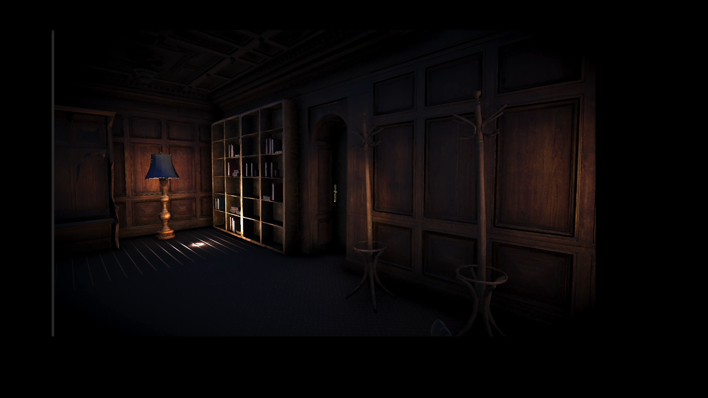

# Project-Chaos
Karanlıktaki Kaos
Bu proje, Unity kullanılarak geliştirilen bir korku oyunudur. Oyunda, elinizdeki fenerle karanlık yerlerde dolaşıp kaosu yok etmek amacındasınız. Projede kullanılan bazı özellikler:

Decal & Event Sistemleri
Işıklandırma (Lights)
Volume Processing
Post Processing
Ses Efektleri & Ortam Müzikleri

## İçindekiler
- [Özellikler](#özellikler)
- [Görseller](#görseller)
- [Kod Örnekleri](#kod-örnekleri)
- [Katkıda Bulunanlar](#katkıda-bulunanlar)
  
## Özellikler
Korku Temalı Mekanikler: Elinizdeki fener, karanlık mekânlarda ilerlemek için kritik bir rol oynar.
Gelişmiş Atmosfer: Unity’nin Lights ve Volume Processing özellikleri ile korku atmosferi derinleştirilir.
Decal ve Etkileşim: Zemin veya duvar üstüne yansıtılan efektler ve oyuncu etkileşimleri (örneğin kapı açılması ya da sürpriz efektler).
Post Processing: Görsel kalitenin arttırılması, renk düzenlemeleri, kontrast ve gölge efektleri.
## Görseller

### Oyun Başlangıç Ekranı

### Oyun İçi Görüntü

### Karanlık Bir Geçit

## Kod Örnekleri
Aşağıda proje içinde kullanılabilecek bazı basit kod örnekleri verilmiştir.

### Fener Açma/Kapama
    {
        Ray ray = new Ray(spotlight.transform.position, spotlight.transform.forward);
        RaycastHit hit;

        if (Physics.Raycast(ray, out hit, Mathf.Infinity))
        {
            GameObject hitObject = hit.collider.gameObject;

            if (hitObject.CompareTag("Destructible"))
            {
                if (hitObject == currentTarget)
                {
                    timer += Time.deltaTime;

                    if (timer >= destroyTime)
                    {
                        StartCoroutine(FadeOutAndDestroy(hitObject));
                        currentTarget = null;
                        timer = 0f;
                    }
                }
                else
                {
                    currentTarget = hitObject;
                    timer = 0f;
                }
            }
            else
            {
                currentTarget = null;
                timer = 0f;
            }
        }
        else
        {
            currentTarget = null;
            timer = 0f;
        }
    }

    private IEnumerator FadeOutAndDestroy(GameObject obj)
    {
        Renderer renderer = obj.GetComponent<Renderer>();

        if (renderer != null)
        {
            Material material = renderer.material;
            Color originalColor = material.color;

            float fadeDuration = 1f;
            float fadeElapsed = 0f;

            while (fadeElapsed < fadeDuration)
            {
                fadeElapsed += Time.deltaTime;
                float alpha = Mathf.Lerp(1f, 0f, fadeElapsed / fadeDuration);
                material.color = new Color(originalColor.r, originalColor.g, originalColor.b, alpha);
                yield return null;
            }
        }

        Destroy(obj);
    }

### Basit Bir Event Tetikleyici

    private void HorrorEvent()
    {
        Collider collider = GetComponent<Collider>();
        collider.enabled = false;

        koltuk.AddForce(throwDirection.normalized * throwForce, ForceMode.Impulse);
    }

## Katkıda Bulunanlar
Ömer Faruk Daşdemir
Batuhan Belli

## Teşekkürler!
Project-Chaos (Karanlıktaki Kaos) projesine gösterdiğiniz ilgi için teşekkürler.
Her türlü soru veya geri bildirim için bizimle iletişime geçmekten çekinmeyin!
